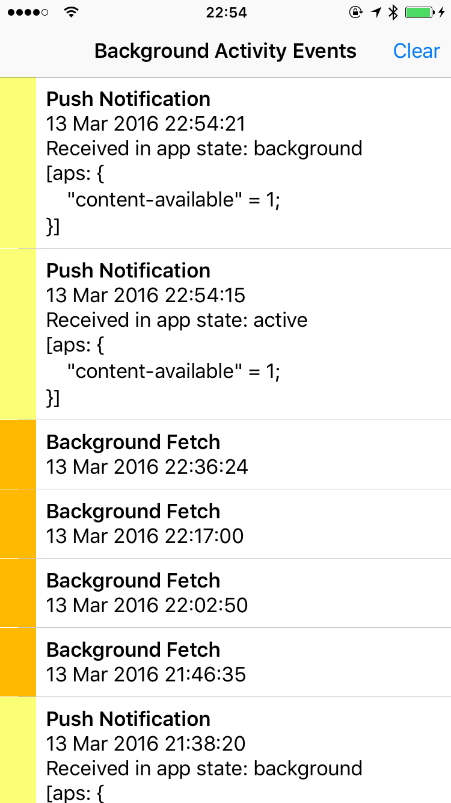

# Silent Push

An iOS test app for testing [silent push notifications](https://developer.apple.com/library/ios/documentation/NetworkingInternet/Conceptual/RemoteNotificationsPG/Chapters/TheNotificationPayload.html#//apple_ref/doc/uid/TP40008194-CH107-SW6) and [background fetching](https://developer.apple.com/library/ios/documentation/iPhone/Conceptual/iPhoneOSProgrammingGuide/BackgroundExecution/BackgroundExecution.html#//apple_ref/doc/uid/TP40007072-CH4-SW56).

Written by [Ole Begemann](http://oleb.net), March 2016.

Swift 2.1 (Xcode 7.2), iOS 9.2.

## Overview

The app monitors whenever it receives a push notification (regardless if the app is in the background or currently active) or the OS wakes it up for a background fetch and saves these events in a list. When an event occurs while the app is in the background, it increments the app icon badge number to tell you something has happened.

You can use the app to test how push notifications and background fetch events are delivered by the OS under varying conditions, such as permission settings or power source.



## Usage

1. Clone the repository and open the project in Xcode.

2. If you want to send push notifications for testing, you must do the following:

    a. Change the app’s bundle identifier in Xcode.
    b. Register an App ID and create a push certificate (for the development environment) on [Apple's developer site](https://developer.apple.com/account/ios/identifier/bundle).

3. Run the app. On first launch the app will ask you for permission to send you notifications. It does this _only_ to be able to set the app icon badge number on the home screen (incremented whenever the app receives a silent push or background fetch event while it is in the background), so I suggest you allow notifications. No user permission is required for an app to receive silent push notifications, however, so feel free to not give permission.

4. Copy the device’s push notification token in the Xcode console, e.g.:

    ```
    application(_:didRegisterForRemoteNotificationsWithDeviceToken:): <66175d5c 3ac68a6a df30a980 84697476 ef7a8f29 127f7f1f c487839f a3ba7796>
    ```

    You’ll need the token to send push notifications to your device for testing.

5. Observe how the app receives push notifications and background fetch events in different states:

    a. Active in the foreground.
    b. Suspended in the background.
    c. After force-quitting it from the app switcher.
    d. Change the app’s permissions to receive notifications and/or perform Background App Refresh in Settings.

## Sending Push Notifications

I recommend Mattt Thompson’s [Houston](https://github.com/nomad/Houston) for sending push notifications from the command line (part of the [Nomad](http://nomad-cli.com) set of command line tools).

After you have installed Houston and downloaded your push notification certificate from Apple, sending a silent push notification is as easy as this:

```sh
$ apn push <TOKEN> \
    --certificate <PATH_TO_PUSH_CERT> \
    --payload '{ "aps": { "content-available": 1 } }'
```

where `TOKEN` is the device token without spaces, e.g. `66175d5c3ac68a6adf30a98084697476ef7a8f29127f7f1fc487839fa3ba7796` and `PATH_TO_PUSH_CERT` is the path to your push certificate. Feel free to experiment with varying payloads. The `"content-available": 1` key-value pair specifies a silent push notification.
